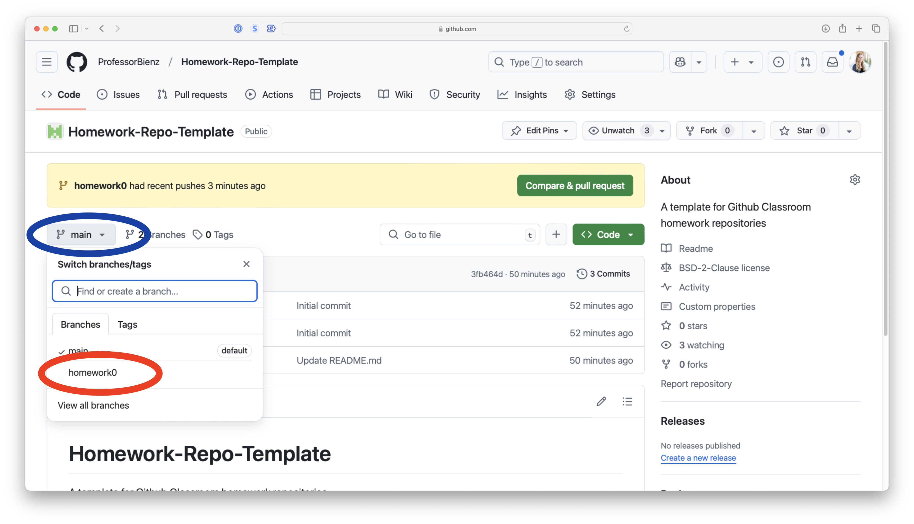

# Homework-Repo-Template
A template for Github Classroom homework repositories

# Getting Started
To begin your homework, you will want to checkout the branch corresponding to the current assignment.

For example, to start homework 0, checkout the branch `homework0`.

